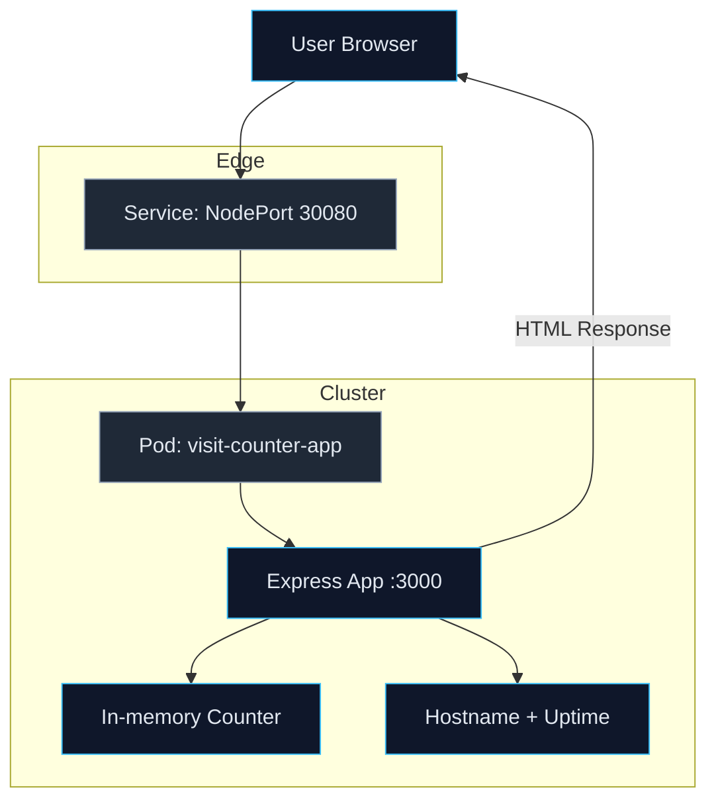
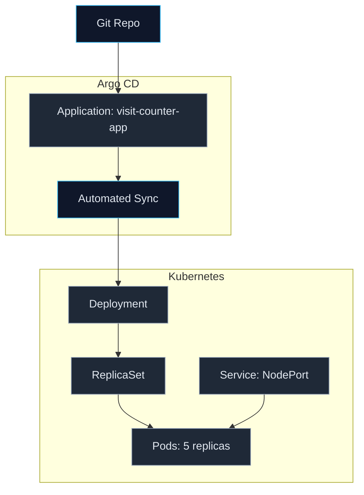
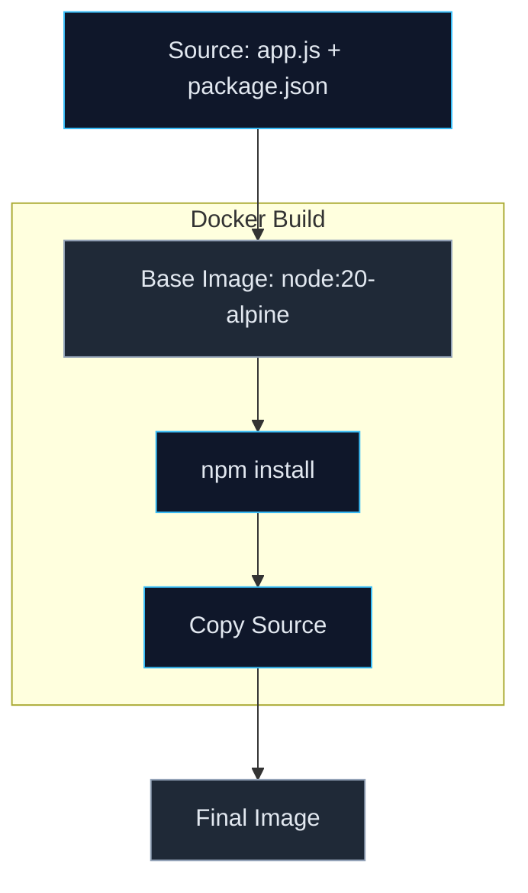
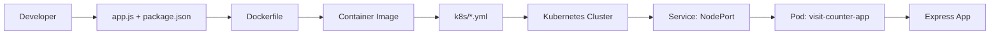
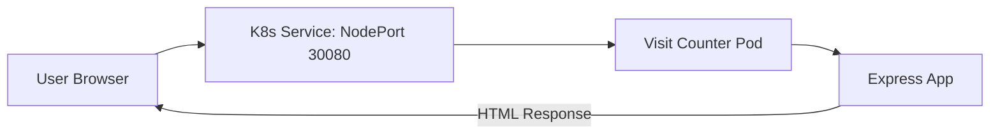
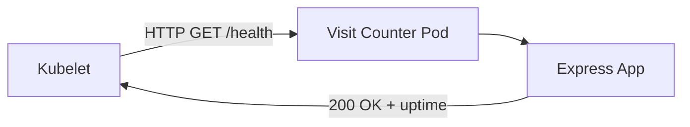
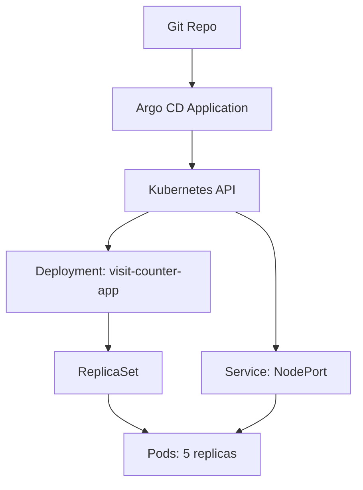
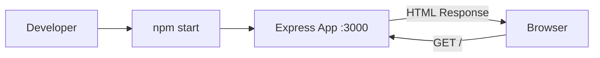

# Visit Counter App

A simple Node.js + Express web app that displays a visit counter, hostname, and uptime. Includes Docker and Kubernetes manifests plus an Argo CD application for GitOps deployment.

## Features
- In-memory visit counter
- Health endpoint for probes
- Containerized with Docker
- Kubernetes Deployment + Service
- Argo CD Application for automated sync

## Endpoints
- `GET /` - HTML page with visit count, hostname, and uptime
- `GET /health` - JSON health check

## Run Locally
```bash
npm install
npm start
```
App listens on port 3000.

## Run with Docker
```bash
docker build -t visit-counter-app .
docker run -p 3000:3000 visit-counter-app
```

## Deploy to Kubernetes
```bash
kubectl apply -f k8s/deployment.yml
kubectl apply -f k8s/service.yml
```
Service is exposed as NodePort 30080.

## Deploy with Argo CD
```bash
kubectl apply -f argocd/deployment.yml
```
Argo CD will sync the manifests from the `k8s` folder in the configured Git repository.

## Flow Diagrams

### Architecture Flowcharts

#### 1. Runtime Request Path


#### 2. GitOps Deployment Path (Argo CD + Kubernetes)


#### 3. Container Build Path


### Component Interconnections


### Request Flow


### Health Probe Flow


### Kubernetes Control Flow


### Local Dev Flow


## Project Structure
- app.js
- Dockerfile
- package.json
- k8s/
  - deployment.yml
  - service.yml
- argocd/
  - deployment.yml
